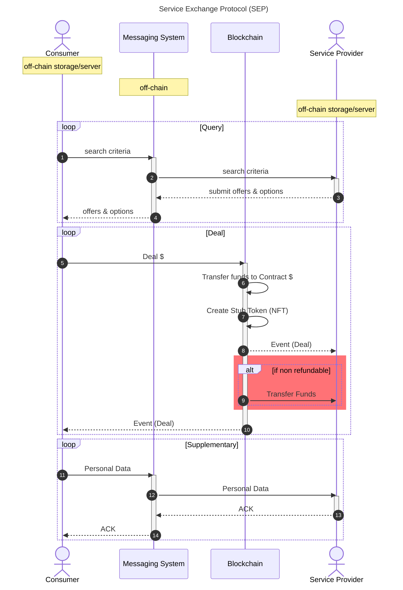
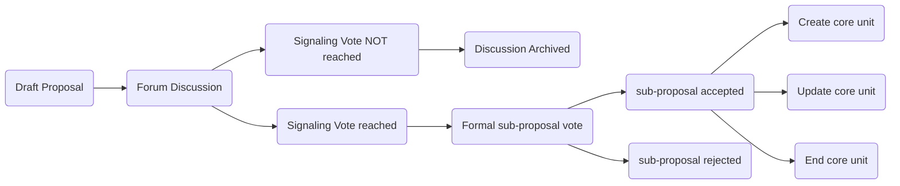
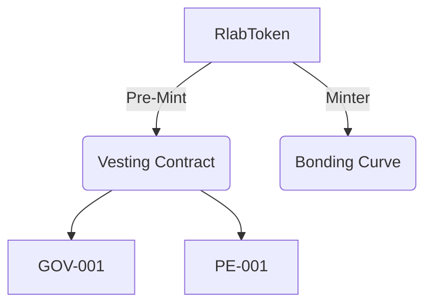
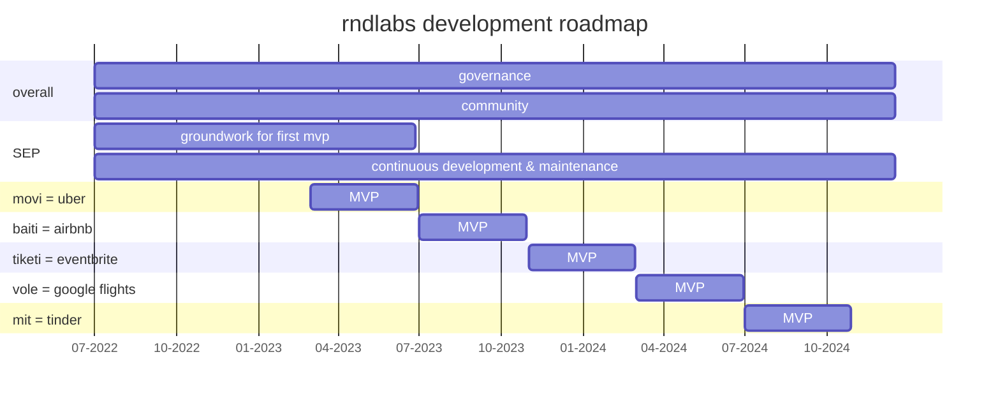

rndlabs White Paper
====

> THIS IS A WORKING DRAFT

## Table of Contents
[TOC]

# Introduction

rndlabs aims to become a digital incubator where contributors collaborate to experiment and build open-source, peer to peer tools that deliver solutions to ubiquitious, real-world problems.

This white paper aims to give a comprehensive overview of why rndlabs is being created, what it will do and how it will operate. However, this white paper is *not* a standalone document - but should be read in conjunction with  [rndlabs Improvement Proposal 0](#rndlabs-Improvement-Proposals-RIPs), hereafter referred to as RIP-0. This RIP was ratified by the first contributors and subsequently triggered the publication of this white paper.

We recommend reading this white paper first, but advise you to go over everything included in - [RIP-0](/v2uAX3mtRPiHfgsJHzb2jg) to get a full-picture of rndlabs.

It is important to keep in mind that this white paper is _not_ immutable, but is infact a living document. For minor and syntax edits you can comment directly on HackMD, or raise an issue on the linked GitHub repository. For any future major modifications anyone can raise an [rndlabs improvement proposal (RIP)](#rndlabs-Improvement-Proposals-RIPs) the same goes for all supporting documentation. 

## Vision, Mission and Values

Our goal is to provide industries the tools that they need to liberate themselves from landlord markets. We aim to create a world where businesses have open-source, permission-less and decentralised tools through which to connect with their users and communities. Success in our mission will be marked by an *epochal change* in industry conduct, from it's current shareholder-focused nature, transitioning to a stakeholder-focused nature - governed and owned by the very communities that meet daily in these marketplaces to exchange value.

In order to realise this new epoch, rndlabs is focused building on a blockchain-secured, consumer-anonymous, peer-to-peer protocol for creating real-world service marketplaces which, to make it short it is a service exchange protocol (SEP). We are currently in progress building [_movi_](#movi), the first industry implementation of SEP focused on creating a decentralized ride-hailing app. Though, this is only the first industry.

Our aim is to not be overly prescriptive from the start yet, we do believe that rndlabs is being established on top of a few core values and principles:
* **Transparency**; to create high levels of trust, data, information and knowledge should be and remain open to all internal contributors and external parties.
* **Adaptability**; resilient systems are those that are malleable to their environment, a good example of this are natural systems like [mycelial fungi.](https://www.sciencedirect.com/science/article/abs/pii/S1749461312000024)
* **Free inquiry**; any contributor should have the freedom to interrogate, investigate and discuss any ideas within the context served without being shutdown. 
* **Autonomy**; contributors should be provided with the tools and knowledge to operate with high levels of autonomy, the same goes for core units.

# Service Marketplaces
In 2019 the share of services as an economic sector in the global gross domestic product (GDP) was 64.79%[^1]. On top of that, most of the services exchanged happen digitally today, whether that is searching for a hotel, getting to the other side of town, finding a lawyer, or even finding your significant other.

[^1]: https://www.statista.com/statistics/256563/share-of-economic-sectors-in-the-global-gross-domestic-product/

However, there is no protocol for service providers to create, store and sell their services on the internet. Service providers are often dependent on intermediaries that act as an agent in the exchange of those services, which in return often take a hefty commission/fee for enabling that exchange. Another alternative which in many sectors has grown in popularity over the last few years thanks for technology becoming more user-friendly is for service providers to create their own marketplaces, yet that often turns out to be very costly, time-intensive and a coordination nightmare if it entails working with close competitors. 

> So, what would a service exchange standard look like?

Right now you are probably reading this white paper thanks to Hypertext transfer protocol secure (HTTPS), the secure version of HTTP, which is the primary protocol used to send data between a web browser and a website. This protocol is used every day and is one of the backbones of the world wide web, enabling pretty much anyone around the world to open websites regardless of the device or browser they are using.

Similarly, by creating a protocol for the exchange of services, the aim is that we create a standard for digitally storing inventories from service providers as well as the calls required for buyers to inquire for services and the means in which to settle payment for them. 

# Service Exchange Protocool (SEP)

SEP is a blockchain-secured, consumer-anonymous, peer-to-peer protocol for creating real-world service marketplaces.

It allows anyone to create a service marketplace for the following structures:
1. Service delivery at a fixed address (e.g. a hotel or barber)
2. Service delivery between two or more known, fixed addresses (e.g. trains or flights)
3. Service delivery between two or more random addresses (e.g. ride-hailing or food delivery)

The folllowing sections aim to provide you with an understanding of the design and components of SEP, if you are interested in testing it yourself and running a proof of concept please refer to the [technical documentation](xxx).

## Overview

The specifications describe how real-world service providers and consumers interact using the protocol to effect an exchange of a service. This allows anyone to create an industry-specific marketplace on which to advertise service providers inventory in a permissionless, decentralised manner.

To ensure that SEP is resilient and remains strongly connected to our values there are some core design requirements for the protocol:

| Design Requirements                                                                                                                    | Rationale                                                                                                |
| -------------------------------------------------------------------------------------------------------------------------------------- | -------------------------------------------------------------------------------------------------------- |
| **Anonymity:** Consumers who are searching for inventory should not have any identifying information conveyed to the service provider. | Protection against an adversarial business targetting users with aggressive pricing strategies.          |
| **Transparency:** All actors bearing witness to the exchange must be able to see clearly the terms by which services are exchanged.    | Allowing all in the marketplace to see the prices being offered and settled (akin to an L2 orderbook)    |
| **Data ownership:** Service providers must be able to completely control their inventory. This control may be delegated.               | Prevent vendor lock-in and subsequent rent extraction techniques.                                        |
| **Decentralised:** The protocol must be permissionless, relying on no centralised infrastructure.                                      | Enough to remove the possibility that service providers are unreasonably censored from the marketplaces. |

## Terminology
To better understand SEP here is some key terminology used:
- **Service provider** refers to an entity providing an intangible act for which another party is willing to pay for.
- **Consumer** refers to the party purchasing the intangible act.
- **Stub** represents a service owed by the service provider to the consumer subject to terms.
- **Messaging system** refers to the chosen protocol on which the service provider and consumer have agreed to communicate.
- **Personally identifiable information** (PII) refers to any piece of data that can be used to uniquely identify a user. For example, the signature verification key, and the hash of one's static IP address are unique for each user and hence count as PII.

## Process

The sequence diagram below aims to give you an overview of the process for SEP and provides you with a good example of each layers that are needed for a real-world service exchange on SEP.

### Verification
Messages exchanged and data stored are verified using an on-chain registry of valid service providers. This registry provides:

1. Role-based authentication to verify signers for the service-provider.
2. Document timestamping for data storage.

## Messaging (off-chain)
The protocol is designed to be messaging system agnostic. For the quick-start and proof-of-concept implementations, the messaging system used is [Waku](htpps://waku.org). It fulfills the design requirement for anonymous, data ownership and decentralised messaging. In order to meet the transparency design requirements, no attempts are made to obfuscate / encrypt data. Authenticity is asserted using payload signatures verified against a blockchain registry.

## Storage (off-chain)
The protocol is designed to be storage system agnostic. For the quick-start and proof-of-concept implementations, the data storge system used is [IPFS](https://ipfs.io/). It meets the design requirements of decentralised and data ownership. A requirement for pinning nodes in IPFS requires further analysis to make sure that the data remains available for continuous Dapp usage.

## Execution (on-chain)
The execution layer is the only one using blockchain technology. SEP is chain agnostic, yet the proof-of-concept will use the [Gnosis Chain](https://www.gnosischain.com/) (formerly xDai chain) an [Ethereum](https://ethereum.org) sidechain. There are many benefits to using Gnosis Chain, the main one being that [Dai](https://makerdao.com/en/) (a stablecoin) is used to pay for gas fees which makes the cost of executing transactions much more predictable.

## Protocol Development Status
SEP was initially conceptualised at the start of 2022, and over the past few months considerable progress has been made, yet there are still some important milestones to be reached and some potential risks and issues that should be accounted for.

### Testing

### Next Steps

### Risks & Issues

  
>For more details on the protocol please refer to the [technical documentation](xxx).

## Implementations & Examples
SEP is industry agnostic, and is applicable to any sercice marketplace. To be more specific, this does exclude any industry that sells primary (e.g. oil, minerals) or secondary (e.g. cars, furniture) goods. The list of [different categories](https://en.wikipedia.org/wiki/Category:Service_industries) in the service industry is extensive, however, a few have been selected to be the first implementations of SEP. The decision has been based on multiple factors such as the current context of the team with regards to talent and development, the potential business case and the market dynamics of that category.

In the following sections we give a brief overview of the industries that could use such a protocol. Even though it is tempting, we will refrain from listing the many articles or complaints that have been brought to by either suppliers or consumers against the many example of companies below, and, will focus on how SEP simply just provides the world with a better alternative for building service marketplaces and will with time make the incumbents redundant. 

Please keep this in mind for the figures in the upcoming tables:
- Service Exchange Cost; aims to give an average of the cost per each single exchange including all the fees and commissions taken by the platform. This excludes other potential costs such as [payment service provider fees](https://www.merchantmaverick.com/the-complete-guide-to-credit-card-processing-rates-and-fees/) or [appstore fees](https://appradar.com/blog/google-play-apple-app-store-fees).
- Market Cap; figures were taken on the 2nd of July 2022 for each of the examples. Some of the examples are private companies so, the market cap is often less accurate than publicly traded entities. Note that for OpenTable the figure is the acquisition price of 2014. 

### Transportation
The transportation industry is vast and includes more than just services. Here is a list of a few potential SEP implementations.

| Category       | Example        | Service Exchange Cost | Market Cap   |
| -------------- | -------------- | ---------------------- | ------------- |
| ride-hailing   | Uber           | Average of 25% [^2]     | $41.905B [^3] |
| carpooling     | BlaBlaCar      | Average of 20% [^4]     | $1.6B [^5]    |
| Trains & Buses | Trainline      | Average of 5% [^6]      | £1.402B [^7]  |
| Flights        | Google Flights | Undetermined yet if we benchmark with the average cost-per-click it could be approximately $1 per click [^8]      | > $1B? [^9]   |

[^2]: https://therideshareguy.com/whats-the-real-commission-that-uber-takes-from-its-drivers-infographic/
[^3]: https://finance.yahoo.com/quote/UBER?p=UBER&.tsrc=fin-srch
[^4]: https://blog.blablacar.co.uk/blablalife/lp/service-fees
[^5]: https://craft.co/blablacar
[^6]: https://www.sharecast.com/news/news-and-announcements/trainline-agrees-reduced-commission-on-ticket-sales--9497163.html
[^7]: https://finance.yahoo.com/quote/TRN.L?p=TRN.L
[^8]: https://www.webfx.com/blog/marketing/much-cost-advertise-google-adwords/
[^9]: https://abc.xyz/investor/static/pdf/20220202_alphabet_10K.pdf?cache=fc81690

Aggregating the services listed above to create major micro-mobility marketplaces for cities or countries could become much easier. Additionally, given the nature of the protocol and the lower exchange cost, bringing on public transportation services that cannot afford to pay high distribution costs could become much easier. 

### Tourism
The Tourism industry in 2019 had a share of 10.3% of the global GDP [x](https://www.statista.com/statistics/1099933/travel-and-tourism-share-of-gdp/), here are a few of the potential SEP implementations:

| Category           | Example      | Service Exchange Cost         | Market Cap   |
| ------------------ | ------------ | ------------------------------ | ------------- |
| Accommodation      | Booking      | Average of 15% [^10]              | $72.633B [^11] |
| Restaurants & Bars | OpenTable    | $1 per seat + subscription [^12] | $2.6B [^13]    |
| Entertainment      | GetYourGuide |Average of 20% [^14]                              | $1.8B [^15]    |

[^10]: https://www.igms.com/booking-com-fees/  
[^11]: https://finance.yahoo.com/quote/BKNG?p=BKNG
[^12]: https://blog.opentable.com/how-opentable-works-for-restaurants/
[^13]: https://www.crunchbase.com/acquisition/the-priceline-group-acquires-opentable--6270d03c
[^14]: https://www.trekksoft.com/en/blog/viator-vs-get-your-guide
[^15]: https://craft.co/getyourguide
    
The same goes for Tourism in regards to aggregation. Booking Holdings and the Expedia Group have been working hard making key acquisitions to offer an all-in-one experience for people buying travel products. Using SEP as the underlying protocol could turn out to be much more efficient and beneficial to both suppliers and consumers. 

### Other Categories
Here are some additional categories that we foresee as being built on top of SEP. 

| Category           | Example     | Service Exchange Cost    | Market Cap  |
| ------------------ | ----------- | --- | ------------ |
| Events & Tickets   | Eventbrite  |Average of 4% [^16]    | $1.1B [^17]  |
| Food delivery      | Deliveroo   |Average of 30% [^18]     | $7B [^19]    |
| Grocery deliveries | Instacart   |Average of 5% (negotiated rate with suppliers)[^20]     | $39B [^21]    |
| Online dating      | Match Group | Subscription-based [^22]     | $19.96B [^23] |

[^16]:https://www.eventbrite.com/support/articles/en_US/Troubleshooting/how-much-does-it-cost-for-organizers-to-use-eventbrite
[^17]: https://craft.co/eventbrite
[^18]:https://www.cnbc.com/2020/05/01/restaurant-owners-in-britain-call-on-deliveroo-to-drop-commission-fees.html
[^19]: https://craft.co/deliveroo
[^20]:https://productmint.com/the-instacart-business-model-how-does-instacart-make-money/
[^21]: https://craft.co/instacart
[^22]: https://tinder.com/feature/subscription-tiers
[^23]: https://finance.yahoo.com/quote/MTCH

The categories above show the abstraction or versatility of SEP and the wide scope of implementations that we aim to take at rndlabs. It will of course not be easy to create any of these but we believe that the underlying technology stack to create blockchain-secured, consumer-anonymous, peer-to-peer service markteplaces is finally here. 

# movi
The first implementation of SEP will be [_movi_](#movi),  a ride-hailing marketplace. In the spirit of hope and it becoming a borderless movement we named our first implementation to simply mean move in esperanto.

For now we believe it to be the most straightforward implemenetation of a service marketplace, here are a few of the resons why:

1. Greater [market depth](https://www.investopedia.com/terms/m/marketdepth.asp); in simple terms, there is a higher existing supply and demand of people offering and needing a ride than for example people offering/needing a hotel. Which in turn should also make adoption strategies such as referral programs more efficient and succesful. 

2. Some of the highest predatory pricing and fees; even though uber claims to take an average 25% commission on rides, studies have shown that it can often be considerably higher given that it is a variable fee, [this recent study](https://www.ridester.com/how-much-do-uber-drivers-make/#How_Much_Do_Uber_Drivers_Make) in San Francisco shows that it can go up to 39.01% per ride. These fees are higher than other sectors and at scale have a higher individual income impact to taxi or private hire drivers.

3. Faster and easier user testing; compared to building an accommodation markletplace testing with drivers can be considerably easier, as it can be done by anyone with a driver license (depending on the legislation). Whereas doing testing with hotels or events can take a higher amount of stakeholder coordination due to the higher stakes and number of parties involved.

4. The architecture required for the application requires considerably less storage configurations. Comparably an event or accommodation requires storage and rules for future inventory, with multiple configurations; refundable rates, booking modifications, guests age, length of stay etc. There are nonetheless challenges with live-availability and pricing.

## Market Adoption
Solving the chicken and egg problem when creating new marketplaces is one of the hardest steps in the process. Each market has different dynamics as it includes different contexts, actors, geographies etc. rndlabs will not be focused on creating mass market adoption and will focus on the product and technology. After a successful MVP launch a decision will have to be made to either create a separate core unit to focus on movi or create another organization or entity (to read more about this process see the [roadmap section](#roadmap)). 

By fixing a lot of the plumbing from incumbent ride-hailing apps, there are a few main unique value propositions that movi will offer, that will be difficult to compete against without a similar protocol:
1. **Improved unit economics** thanks to not having payment-service-provider (PSP) fees that can approximate 2-3% and lower tech stack costs which leads to lower transaction fees or commissions for drivers, and in turn could drive prices down for riders.
2. **New unique features**, among others the possibility of having an open order book similar to trading platforms giving riders and drivers more price transparency or control or simply splitting ride costs without requiring the other person from having an account in the app.  
3. Open inventory opening **a Pandora's box of possibilities**. Current apps have their inventories siloed from each other, in the case of movi, the inventory is not locked in, so, as more people build on SEP, it will enable drivers to expose their services to not only a handful of of different apps but potentially hundreds.

Nonetheless, to test each MVP rndlabs will need to generate some level of **market adoption** and measure what matters. This is why there are **two main methods** that we anticipate as being essential in generating initial adoption:
1. **creating a referral program**, like many current ride-hailing apps when inviting a new rider or driver you get a reward. If well designed this can generate a high level of adoption on both sides. 
2. **selecting the right regions or cities** will be another essential step in driving adoption. Focusing on places where there is a high crypto adoption, animosity to the incumbents and a welcoming regulatory environment. 

Beside the points made above in regards to market adoption a strong focus will be made to make movi an inclusive cultural movement. By this we mean one that does not get caught up in dozens of new abstract terms like DAOs, NFTs etc. and focuses on creating a real-world utility to anyone trying to get from one place to another.

## Implementation Development Status
Some work had already been done previously to implement SEP as an accommodation marketplace, yet given the reasons previously presented it was decided to switch towards building a ride-hailing app as the first implementation. Thankfully, a lot of the work done in the accommodation marketplace can be re-used for this industry as well. Below is a summary of the status around the development of movi.

### Current Stage
At the moment movi is still not fully implemented as of yet. For it to reach viability we believe that it should be able to run natively on smartphones, and for that there is a lot work that still needs to be done at the protocol level.  

Simultaneously we have started working on visual prototypes of movi to be able to foresee what will be the differences between a regular ride-hailing app and one that runs on top of peer-to-peer and decentralized components. 

### Next Steps & Timelines
At the moment there are not many core contributors in rndlabs, as we grow the amount of hands on deck we believe that the development of movi could accelerate. Our current projection is to have a minimum viable product of movi within the next year.

### Risks & Issues
There are however, a few potential risks and issues that should be considered, these could considerably extend the development timeline and even the possibility of a fully decentralized ride-hailing app. 

1. **live location with waku**

2. **waku spamming**

3. **reliable storage with swarm**

We expand on further potential risks and issues in the  [Risk Assessment section](#Risk-Assessment). Overall we want everyone considering to contribute to keep in mind that even though some of these technologies have been worked at for more than a decade now, using them in the way we present it here has not, so we are expecting at least a few unexpected obstacles down the road. 

# rndlabs
rndlabs can be defined as a digital incubator where contributors collaborate to experiment and build open-source, peer to peer tools that deliver solutions to ubiquitious, real-world problems.

At the current stage we do not feel comfortable describing it as a DAO, given that the governance process has no self-executing code attached to it, and it is centralized around only a few contributors. For the moment being, we believe that rndlabs has no need to for a legal entity to its name, and can use bits to organize itself as well as reward contributors. 

## Contributors
rndlabs has no co-founders, employees, or contractors, everyone is to be considered a **contributors**, categorized in the following way:
- **core contributors**; actively involved and working in an existing core unit
- **community contributors**; not part of a core unit but an active member in communication and governance platforms.
- **financial contributors**; invested or providing liquidity of RLAB token (this could be an entity providing financial support via grants for example).
- **external contributors**; not active in the rndlabs communication channels, but using or promoting the protocol or any of its implementation (e.g. movi)

## Core Units
rndlabs will be organized in core units; a sub-formation that has a budget attached to it, managed by one or more Coordinators, that facilitate and pay contributors working to achieve a long-term goal within rndlabs.

The main motivation behind it is to create a resilient organization that is less prone to centralization, provides a high-level of autonomy and demands a high-level of transparency. Yet, the good functioning of this framework is mostly dependent on a strong culture of documentation and an intuitive governance process that makes it easy for members to contribute and facilitate cross-unit discussion and collaboration. 

Anyone can propose to create, update, or end a core unit, by the following (simplified) governance process:

*Please keep in mind that htis process will most probably be revised in a future RIP*

RIP-0 includes the proposal to create the first two core units:

| CODE                 | Name    | Description |
| -------------------- | ------- | ----------- |
| Governance           | GOV-001 | Text        |
| Protocol Engineering | PE-001  |             |

### GOV-001

### PE-001
- pro dev
- 

A minimal framework has been layed out in the [rndlabs docs](/ibbDSbDlSK-IqgIiBdVQwQ) to enable a good function of core units from the ratification of RIP-0. A more precise and extensive framework will be defined for core units at a later stage via an [improvement proposal](#rndlabs-improvement-Proposals-RIPs).

####### notes...
- pre-mint 10% for protocol development
    - ring fenced from core units so tokens can't be dumped on the curve
- initial core contributors
    - 1 FE (not react)
    - 2 BE
    - 1 coordinator / facilitator / UX

## Governance

Use of OpenZeppelin Compound Governance and WithTally

### rndlabs Improvement Proposals (RIPs)

#### RIP-0
[RIP-0]() is the first proposal that will be voted on and establishes the existance of rndlabs. It will be the only RIP that does not include a token vote, and is ratified by the first contributors and seeders. It includes the first version of the following:
* White Paper
* Website 
* Contribution Guide 
* rndlabs Docs 
* RIP template
* initial mock-ups
* RIP template

The sequence of industry implementations can be discussed and changed via a [_RIP_](#rndlabs-Improvement-Proposals-RIPs).

### RLAB Token

rndlabs will handle funding via a token, but unlike a conventional ICO and/or aidrop processes, all funds raised from those buying the token will be retained by a smart contract, making the token _collateralised_* (*excluding the pre-mint for [ecosystem expenses](#ecosystem-expenses)).

Importantly, the RLAB token:

* Has **NO** pre-sale conditions for early backers / seeders.
* Ensures that all participants have access to the **SAME** terms (as prescribed by smart contract).

Transparency and openness are core tenants to funding, and as such funding **MUST** abide by the following principles:

1. No liquidity is transferred directly to the DAO.
2. Grants to the DAO and/or community members are to always be paid in a vesting stream, with a maximum of 3 months runway, and a minimum runway top-up of 1 month.
3. All purchasers of a token must have exit liquidity that does **NOT** require new liquidity (ie. at all times the token must remain collateralized).
4. Collateralization for the token shall be in DAI.

- Todo
    - [ ] Insert correct formula for bonding curve
    - [ ] Explain recollateralisation of pre-mint.
    - [ ] Explain governance tooling and research use of WithTally / OpenZeppelin governance on testnet.

#### Bonding Curve

$$
x = {-b \pm \sqrt{b^2-4ac} \over 2a}.
$$

1. Curve based on a *sigmoid* function
2. Acts as an automated market maker, being fully collateralized.

https://www.linumlabs.com/articles/bonding-curves-the-what-why-and-shapes-behind-it

## Roadmap

Keep in mind that this roadmap is very general and is mainly to show the upcoming implementations of SEP and the projected timelines which are based on the past few months of development.

rndlabs is designed to act as an incubator for developing industry instantiations of `SEP`, building _minimum viable products_ (MVP). As an industry implementation approaches a functional MVP, `rndlabs` governance processes will determine what subsequent action should be taken, including but not limited to:

1. Spin out the MVP into a daughter project / organisation.
2. Create a new Core Unit, keeping the project in-house, and giving it the necessary ressources for the next steps in development.
3. Cease development on the MVP.

This could be especially beneficial given that the marketplace dynamics of movi for example might be considerably different and could require other governance processes and talent than the ones found at rndlabs. Nonetheless, there would be a high level of collaboration between a seperate project / organization given that the protocol and a lot of the infrastructure is developed and maintained by rndlabs. 

>*Our estimation is that it will take approximately 120 days to develop a working MVP, **the dates in the chart will most probably change** considerably as rndlabs evolves, one can imagine that if there are many contributors, many different MVPs could be developed simultanously for example.*

### Short-Term Note
First version of whitepaper is dedicated to raise initial funds via a grant during July 2022. While that gets confirmed initial contributors work on:
- protocol development
- movi development
- token
    - development
    - governance
    - economics

Before the public release, the white paper will be edited once again and included in RIP-0.

## Transparency & Legality
- benchmark... nomadlist/open
- reporting

### Finances

#### Funds Management
- wallet mgmt 

### Product

### Governance

### Legal Entity
The aim is to not have any legal entities for rndlabs, yet that does not mean that we do not aim to encode agreements and rules within the organization, the only difference is that we will do that via self-executing code. However, for some dealings a legal entity could become necessary, for that, organizations can be created following the RIP process.

# Potential Risks
At the current stage there have been no external independent audits done on the smart contracts and technology built by rndlabs. Our aim is through our efforts in receiving grants and people financial contributing to rndlabs, external audits can be made to reduce overall risk for current and future contributors.

## Risk self-assessment
In the spirit of simplicity, here are some bullet points that give you an overview of the risks we can foresee, the nested bullet points show a few measures we are taking to limit the main risk.

- unaudited smart contracts
    - clear disclaimers 
    - path towards audit
    - contracts are upgradeable (i.e. can apply fixes after deployment)
- lack of contributors
    - community building 
- low governance participation
    - clear communication and simple process
- reliance on external protocols and technologies
    - waku, ipfs, swarm
    - ethereum and gnosis chain
- 51% attack on core units multi-sig
    - limit with rndlabs multi-sig shared by all units
- pre-mint (100K) of voting power will be in control of the core units (discourages governance participation)
    - funds are ring-fenced, and even by governance action, bonding curve can't be raided.
    - voting power of core units not concentrated in one person, but distributed between units and their contributors / facilitators.

# Glossary of Terms

SEP: Service Exchange Protocol

ACK: 

# Links
[x.MIP39 - MakerDAI Improvement Proposal 39 relating to core units](https://mips.makerdao.com/mips/details/MIP39#specification-proposal-details)

# Footnotes
tiketi swahili for tickets 
baiti georgian for place to stay 
movi esperanto for move 
mit krio for meet 
vole Haitian Creole for fly 
statistics are mainly taken in 2019 (pre-covid)